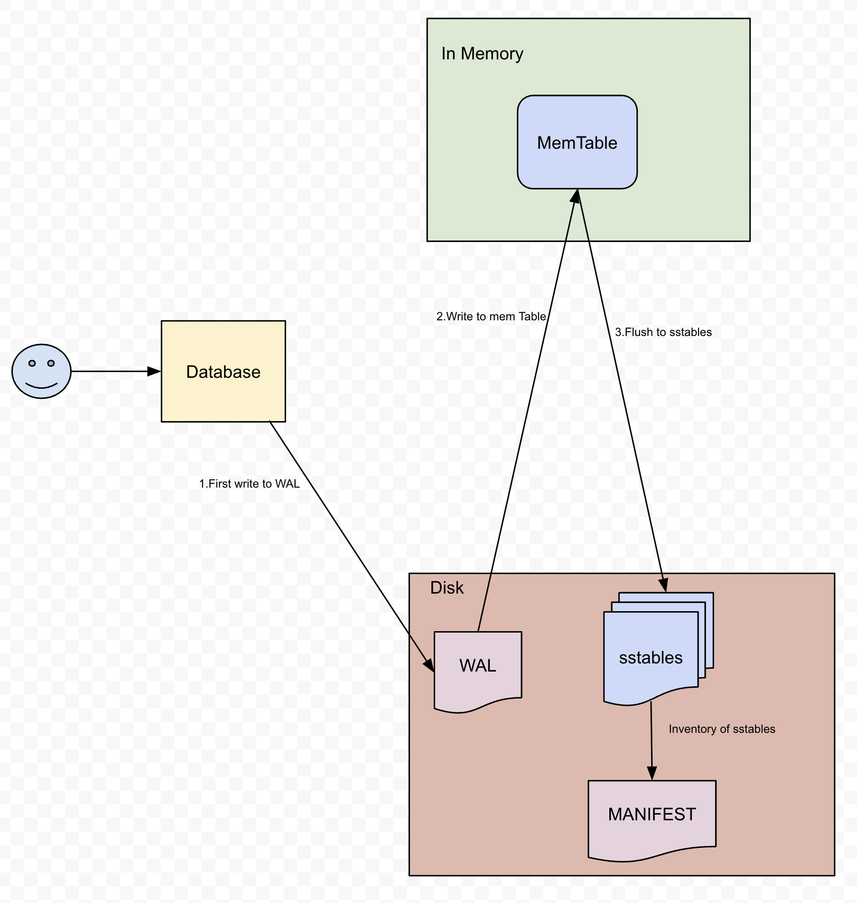
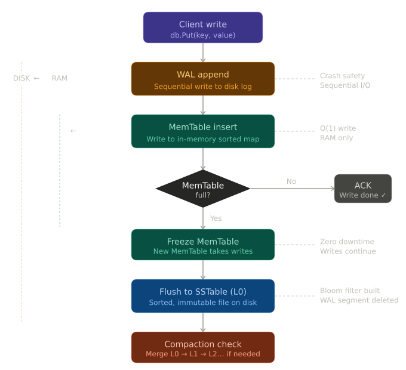
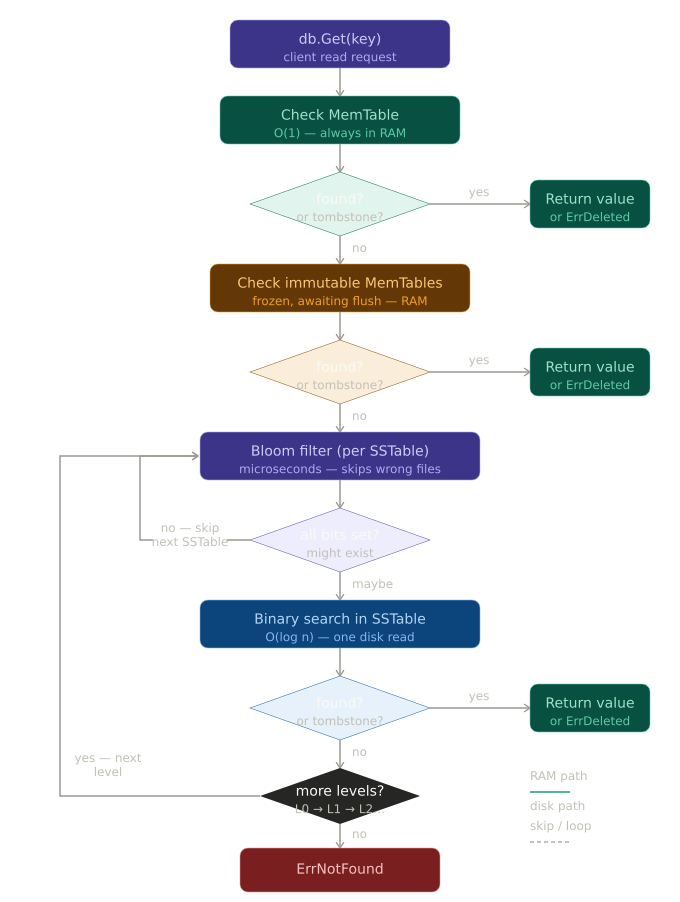

# LSM Tree Database

A write-optimized key-value database engine built from scratch in Go. Think of it like a **car engine** with four specialized parts working together.

## 🏗️ Architecture Overview






> **Visual representation of the four core components**


## 🚗 The Four Components: A Car Engine Analogy

### **1. MemTable - The Fuel Injector**
- **Purpose:** Rapidly accepts incoming data
- **What it does:** Stores data in a fast HashMap, like a fuel injector that quickly sprays fuel into the engine
- **Key trait:** **Speed over durability** - it's in RAM, so if the power cuts, data is lost
- **When it's full:** Gets flushed to disk (like emptying a tank)

**File:** `memtable.go`

---

### **2. WAL (Write-Ahead Log) - The Backup Battery**
- **Purpose:** Ensures durability before anything else
- **What it does:** Records every operation to disk BEFORE it hits MemTable, like a backup battery that saves critical information if power fails
- **Key trait:** **Safety first** - even if the system crashes immediately after writing here, data survives
- **How it works:** Append-only log (never changes old entries), written in JSON for easy debugging

**File:** `wal.go`

---

### **3. SSTables - The Transmission**
- **Purpose:** Converts temporary in-memory data into permanent on-disk format
- **What it does:** When MemTable is full, it's written to disk as sorted, immutable files (SSTables). Like a transmission that converts engine power into usable drive, SSTable converts MemTable data into queryable storage
- **Key trait:** **Sorted order** - enables fast lookups and efficient merging
- **Multiple files:** As more writes happen, multiple SSTables accumulate on disk

**File:** `sstable.go`

---

### **4. Compaction - The Maintenance System**
- **Purpose:** Keeps the engine running smoothly by reducing complexity
- **What it does:** Periodically merges multiple SSTables into fewer files, like an engine maintenance system that reduces wear and improves efficiency
- **Why it matters:** More SSTables = slower reads (must check each file). Compaction reduces file count, speeding up reads
- **When it runs:** Automatically triggered when SSTable count exceeds threshold

**File:** `db.go` (in the `Compact()` method)

---

## 🔄 How Data Flows Through the Engine

### **Write Operation (Put)**
```
User writes data
    ↓
1️⃣ WAL records it (durability first!)
    ↓
2️⃣ MemTable stores it (fast access)
    ↓
3️⃣ Is MemTable full? → Flush to SSTable
    ↓
4️⃣ Too many SSTables? → Compact them
```

### **Read Operation (Get)**
```
User requests data
    ↓
1️⃣ Check MemTable first (O(1) - fastest!)
    ↓
2️⃣ If not found, check SSTables (newest first)
    ↓
3️⃣ Return the value
```

### **Recovery (After Crash)**
```
System restarts
    ↓
1️⃣ Read the entire WAL file
    ↓
2️⃣ Replay all operations in order
    ↓
3️⃣ MemTable is fully restored
    ↓
4️⃣ SSTables on disk are still intact
```

---

## 🎯 Why This Design?

**LSM Trees are write-optimized:**
- ✅ Puts are **very fast** (just hash map + append to WAL)
- ✅ Deletes are **very fast** (mark as tombstone)
- ✅ Survives **crashes** (WAL recovery)
- ⚠️ Gets are **slower** (may need to check multiple SSTables)

**Trade-off:** Optimize for writes (the common case) and accept slower reads for a few keys.

---

## 🚀 Quick Start

```bash
# Build
go build -o lsm-db.exe

# Run demo
go run .

# See it in action
# The demo shows:
# - Basic Put/Get operations
# - Delete with recovery
# - Auto-flush when MemTable is full
# - Auto-compaction when SSTables accumulate
```

---

## 📊 Core Thresholds

| Threshold | Value | Purpose |
|-----------|-------|---------|
| **Flush** | 20 entries | Prevent MemTable from growing too large |
| **Compact** | 5 SSTables | Prevent too many files slowing reads |

---

## 🔧 File Structure

```
├── memtable.go        # The Fuel Injector
├── wal.go             # The Backup Battery
├── sstable.go         # The Transmission
├── db.go              # The Engine (orchestrates all)
├── main.go            # Demo/test
├── go.mod             # Go module
└── .gitignore         # Git config
```

---

## 💡 Key Insights

1. **WAL First, MemTable Second** - If you reverse this, crashes lose data
2. **Check MemTable First** - It's in RAM and O(1), so always fastest
3. **Newest SSTables First** - Most recent data wins
4. **Compaction Reduces Reads** - Fewer files = faster lookups
5. **Tombstones for Deletes** - SSTables are immutable, so mark deletions with special value

---

## 🏁 You Now Understand

- How **fast writes** are achieved (MemTable + WAL)
- Why **durability matters** (WAL ensures survival)
- How **persistence works** (SSTables on disk)
- Why **compaction is needed** (maintains read speed)
- How **recovery works** (replay the log)

This is a production-grade design used in real databases like **RocksDB, LevelDB, Cassandra**, and **Dynamo**.
